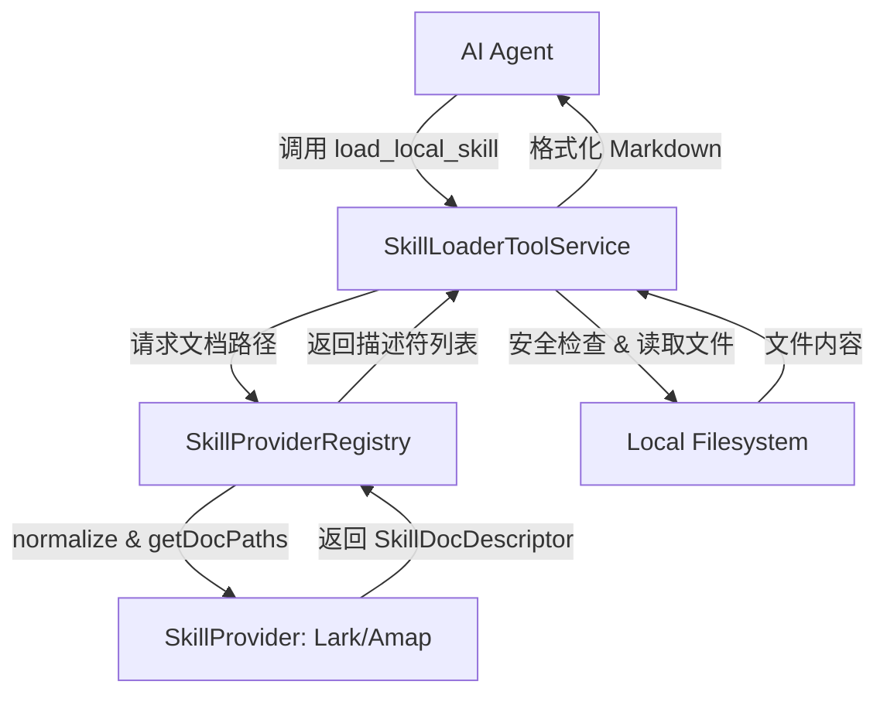
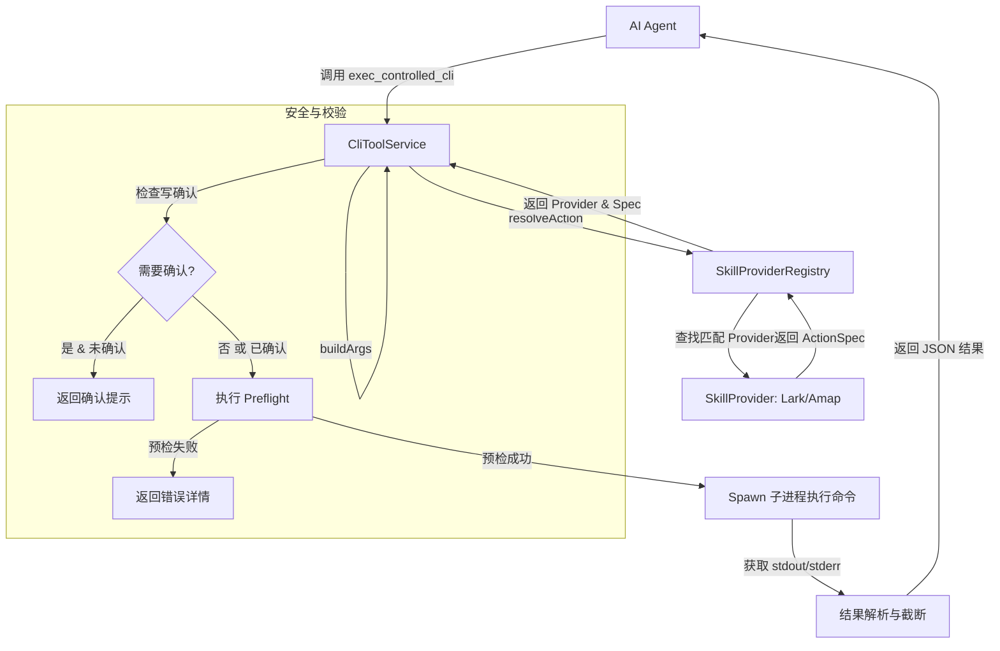

# Skill 逻辑分析报告

本文档分析了项目中暂存的 Skill 相关逻辑，涵盖了从 Skill 的发现、加载到受控执行的完整流程。

## 1. 核心组件分析

### 1.1 接口定义 ([skill-provider.types.ts](file:///Users/xinjie03/Desktop/mickey/agui-backend/src/tool/skill-provider.types.ts))
- **SkillProvider**: 定义了 Skill 提供者的统一接口。包括：
  - `normalizeSkillName`: 统一技能名称（处理别名）。
  - `getPrimaryDoc` / `getSupplementalDocs`: 定位技能的 Markdown 说明文档。
  - `resolveAction`: 将高层 Action（如 `calendar.create`）映射为具体的 CLI 命令规格（`ControlledCliActionSpec`）。
  - `preflight`: 可选的预检逻辑。

### 1.2 注册中心 ([skill-provider.registry.ts](file:///Users/xinjie03/Desktop/mickey/agui-backend/src/tool/skill-provider.registry.ts))
- **SkillProviderRegistry**: 统一调度中心。
  - 持有 `AmapSkillProvider` 和 `LarkSkillProvider` 实例。
  - 提供 `resolveSkillDocs`：遍历提供者以查找文档描述符。
  - 提供 `resolveAction`：根据 Provider ID 快速定位 Action 执行规格。

### 1.3 文档加载器 ([skill-loader-tool.service.ts](file:///Users/xinjie03/Desktop/mickey/agui-backend/src/tool/skill-loader-tool.service.ts))
- **LarkSkillLoaderToolService**: 封装为 LangChain 工具 `load_local_skill`。
  - **职责**：按需读取 `skills/` 目录下的文档。
  - **安全**：包含路径穿越检查（Path Traversal Prevention）。
  - **逻辑**：通过 Registry 获取路径 -> 读取文件内容 -> 格式化为 Markdown 章节返回给 Agent。

### 1.4 CLI 执行器 ([skill-cli-tool.service.ts](file:///Users/xinjie03/Desktop/mickey/agui-backend/src/tool/skill-cli-tool.service.ts))
- **CliToolService**: 封装为 LangChain 工具 `exec_controlled_cli`。
  - **职责**：受控执行 CLI 命令。
  - **逻辑**：
    1. 解析 Action 规格。
    2. 构建参数（支持 `dry-run`）。
    3. **写操作确认**：若 `requiresConfirmation` 为真且未传 `confirmWrite=true`，则拦截并提示用户。
    4. **预检 (Preflight)**：执行环境或权限检查。
    5. **命令执行**：使用 `child_process.spawn` 运行命令。
    6. **结果处理**：捕获输出、尝试解析 JSON、截断过长文本。

---

## 2. 逻辑流程图

### 2.1 Skill 文档加载流程 (Discovery)

### 2.2 Skill 受控执行流程 (Execution)

---

## 3. 步骤详细分析

1.  **Provider 注册**：在 `tool.module.ts` 中注册各种 Provider，并在 `SkillProviderRegistry` 构造函数中按优先级排序。
2.  **名称规范化**：Provider 内部维护别名表（如 `doc` -> `lark-doc`），确保 Agent 输入的灵活名称能对应到确定的物理目录。
3.  **懒加载机制**：Agent 初始状态不包含所有技能详情。当需要使用特定领域（如日历）时，先通过 `load_local_skill` 获取该领域的 API 定义和约束。
4.  **结构化参数转换**：`exec_controlled_cli` 不允许 Agent 发送原始 shell 字符串，而是接收 `args` 对象，由 Provider 的 `buildArgs` 函数安全地拼接为 CLI 数组，防止注入攻击。
5.  **安全围栏**：
    -   **只读默认**：通过 `requiresConfirmation` 标识危险操作。
    -   **环境隔离**：通过 `getExecutionEnv` 传递必要的 Token 或环境变量，而不暴露在全局。
    -   **内容保护**：对返回给 AI 的内容进行截断（6000 字符），防止上下文溢出导致不可控行为。
